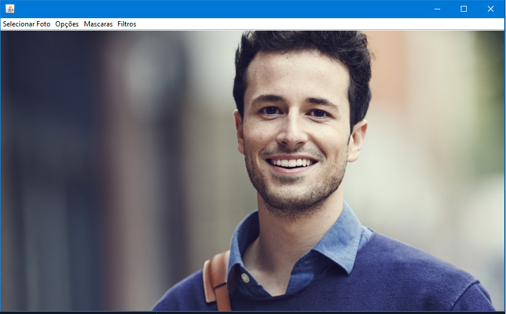
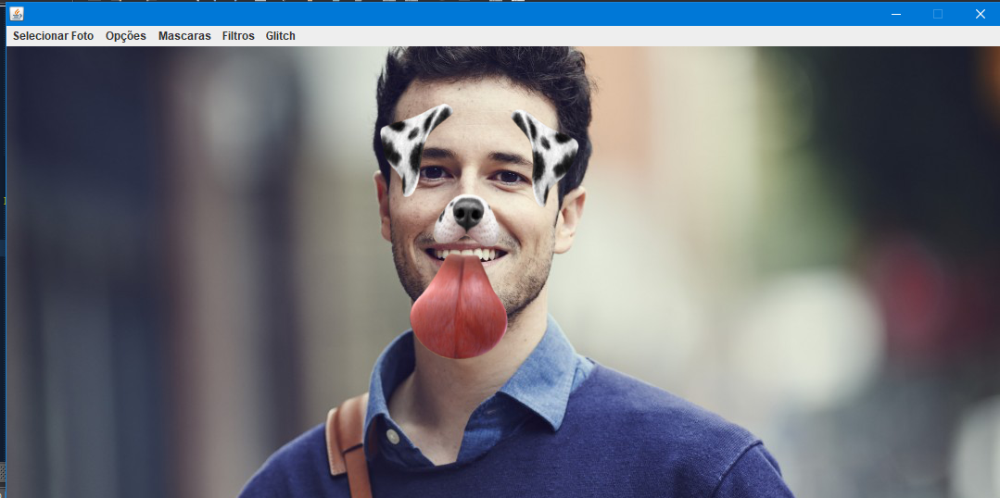
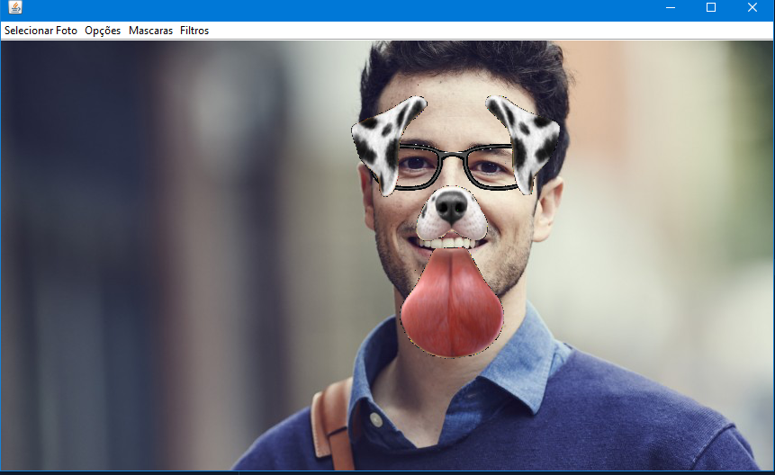
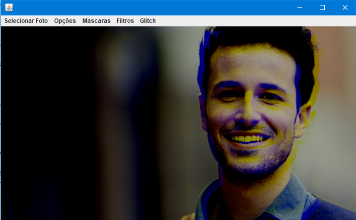
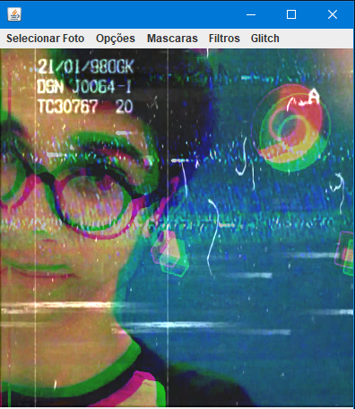

# !! ySelf !!

yself is one project in opencv and java for spnachat effects and filters of image.

The project was developed with the intention of studying opencv !

!! Attention : The project is under development. !!

## Authors

* **Igor Joaquim dos Santos Lima** - [github](https://github.com/igor036)

  

  

  

  

  

  

